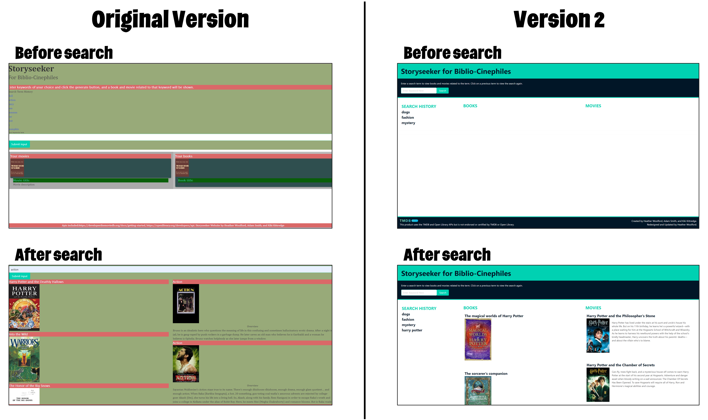

# StorySeeker for Biblio-Cinephiles Version 2

## Description

This is version 2 of a group project created during bootcamp.

StorySeeker for Biblio-Cinephiles is a web application created for lovers of books and movies. Users enter a search term to find books and movies related to their search. This application utilizes APIs from [The Movie Data Base (TMDB)](https://developer.themoviedb.org/docs) and [Open Library](https://openlibrary.org/developers/api) to populate the search results.

This project has been completely overhauled with a new layout, design, and improved responsiveness. View the original version [here](https://hwoolford.github.io/storyseeker-for-biblio-cinephiles/) and the origial GitHub repo [here](https://github.com/hwoolford/storyseeker-for-biblio-cinephiles).

## Technologies Used

- HTML
- JavaScript
- Jquery
- CSS
- Bulma

## Visuals

The images on the left show the original version and the images on the right show the updated version 2.

## Installation

1. Clone the repository to your machine
2. Copy the files to your own repository
3. Conduct the git add, commit, and push commands to update your repository with the copied files
4. Modify the code to meet your needs
5. Commit and push your changes

## Links

- [Deployed Website](https://hwoolford.github.io/storyseeker-for-biblio-cinephiles-v2/)

- [GitHub Repository](https://github.com/hwoolford/storyseeker-for-biblio-cinephiles-v2)

## Resources and Acknowledgments

- [Movie app based on TMDB API | Day 17 | HTML CSS JS | 50Projects50Days](https://www.youtube.com/watch?v=9Bvt6BFf6_U)

- We would like to acknowledge the assistance provided by Xpert, an AI Learning Assistant, in providing guidance and support throughout the development of this project. Xpert's insights and suggestions were invaluable in helping us overcome challenges and improve the quality of our work. (Acknowledgement written by Xpert)
